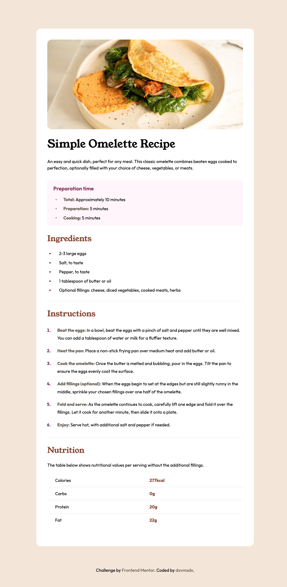

# recipe page

Frontend Mentor에서 제공하는 [챌린지](https://www.frontendmentor.io/challenges/recipe-page-KiTsR8QQKm)를 연습한 프로젝트입니다.  
웹페이지의 구조와 의미를 명확하게 하기 위해 시맨틱 태그를 사용했습니다.

## Screenshot



## My process

### Built with

- Semantic HTML5 markup
- CSS variable
- Flexbox

### What I learned

#### 웹 폰트 연결

```css
@font-face {
  font-family: 'young serif';
  src: url(../assets/fonts/young-serif/YoungSerif-Regular.ttf);
}
@font-face {
  font-family: 'outfit';
  src: url(../assets/fonts/outfit/Outfit-VariableFont_wght.ttf);
}

body {
  font-family: outfit, sans-serif;
}
```

#### 리스트 스타일

lists에 `list-style-type` 속성으로 구분점을 변경할 수 있다. (유니코드 사용 가능)

```html
<ol class="lists">
  <li class="list">2-3 large eggs</li>
  <li class="list">Salt, to taste</li>
  <li class="list">Pepper, to taste</li>
</ol>
```

```css
.lists {
  /* `list-style-position`의 기본 속성값은 `outside`이므로 `padding-left`를 이용해 문단 안으로 위치를 조정. */
  padding-left: 0.8rem;
}

.list {
  /* 목록 구분점과 목록 사이의 간격 조정 */
  padding-left: 1.3rem;
}

/* 구분점 스타일 지정 */
.list::marker {
  color: var(--color-rose-800);
  font-weight: bold;
}
```

### Continued development

- 레이아웃 구조 잡는 연습. ✅ 박스 모델
- CSS 변수 사용. ✅ 일관성
